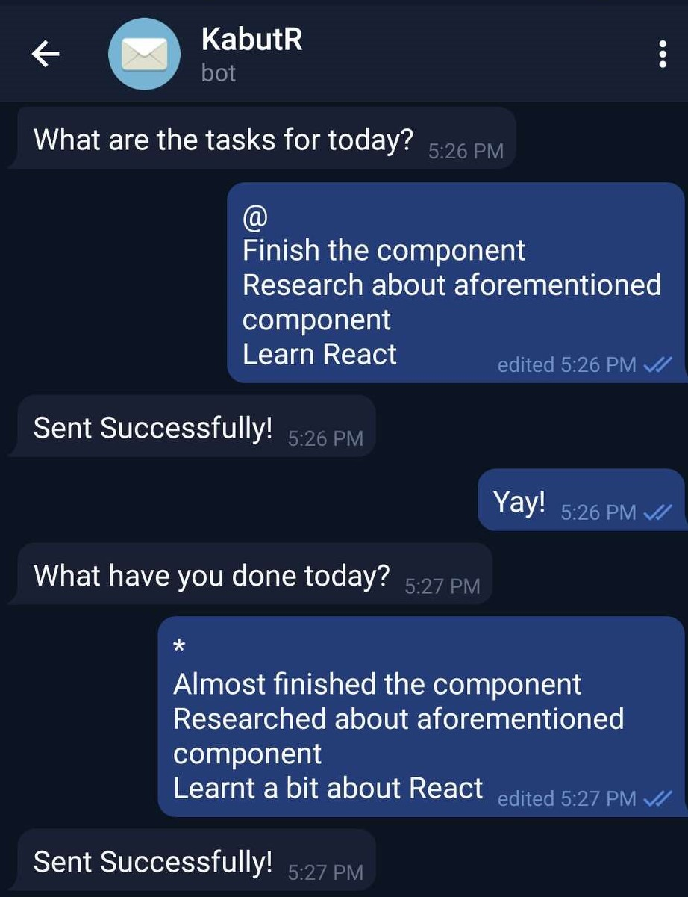

# KabutR

KabutR is an automated mailing system and reminder built with NodeJs and Telegram Bot API

  - Reminder as a text message on Telegram
  - Reply with work to do/done
  - Magic!
 
## Working Screenshots
### Conversation with Telegram Bot


### Mail Received to the mentioned contacts!


## Usage

  - Clone to your system
  - Add your token.json and credentials.json files as:
  ```json
{
    "token": "TOKEN HERE"
}
```

```json
{
    "email": "MAIL ID HERE",
    "password": "MAIL'S PASSWORD",
    "chatId": "<Your CHAT ID with the bot>"    
}
```
  - Edit your contacts to be sent in mailTo.json
  - Set mail times in mailTimes.json
  - Edit mailConfig with your own mail configuration
